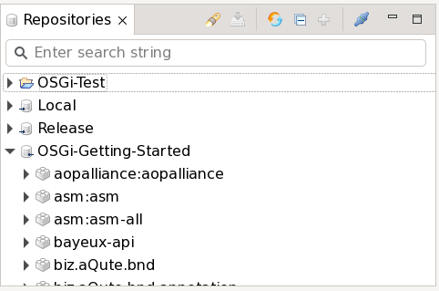

# Using a Service

Now let's really use the log service. Activate the log statement in `HelloWorld` and replace the `System.out.println` statements in `Activator` (comments regarding features explained already have been removed):

```java
public class Activator implements BundleActivator {

    private ServiceTracker<LogService, LogService> logServiceTracker;
    static public LogService logService = null;
    private HelloWorld helloWorld;

    @Override
    public void start(BundleContext context) throws Exception {
        if (logServiceTracker == null) {
            logServiceTracker = new ServiceTracker<LogService, LogService>(
                    context, LogService.class, null) {
                @Override
                public LogService addingService(ServiceReference<LogService> reference) {
                    LogService result = super.addingService(reference);
                    if (isPreferred(reference)) {
                        logService = result;
                    }
                    if (helloWorld == null) {
                        logService.log(LogService.LOG_INFO, "Hello World starting.");
                        helloWorld = new HelloWorld();
                        helloWorld.start();
                        logService.log(LogService.LOG_INFO, "Hello World started.");
                    }
                    return result;
                }

                private boolean isPreferred(ServiceReference<LogService> candidate) {
                    ...
                }
                
                @Override
                public void removedService(ServiceReference<LogService> reference,
                                           LogService service) {
                    super.removedService(reference, service);
                    LogService nowCurrent = getService();
                    if (nowCurrent != null) {
                        logService = nowCurrent;
                        return;
                    }
                    if (helloWorld != null) {
                        logService.log(LogService.LOG_INFO, "Stopping Hello World.");
                        helloWorld.interrupt();
                        try {
                            helloWorld.join();
                        } catch (InterruptedException e) {
                        }
                        helloWorld = null;
                        logService.log(LogService.LOG_INFO, "Hello World stopped.");
                    }
                    logService = null;
                }
            };
        }
        logServiceTracker.open();
    }

    @Override
    public void stop(BundleContext context) throws Exception {
        logServiceTracker.close();
    }
}
```

Running this shows ... nothing. Well, not really nothing, "Hello World" is printed all right. But there are no log messages. Like me, you might be tempted to start searching for a log file. Don't, you won't find anything.

The log service is designed a bit differently from what you expect from a logging *facility*. When `log` is called, the log service creates a `LogEntry`, stores it in an overwriting circular buffer with implementation-specific size and notifies any registered `LogListeners`. In order to see anything, we first have to install and start a bundle that provides and registers a 
[LogListener](https://osgi.org/javadoc/r6/cmpn/index.html?org/osgi/service/log/LogListener.html) with the [log reader service](https://osgi.org/javadoc/r6/cmpn/index.html?org/osgi/service/log/LogListener.html). The log listener forwards the log entries to the console, a file or whatever.

One would assume that it should be easy to find a simple OSGi bundle that implements this functionality. But, I (or the search engine) failed. Instead of spending more time on searching, I decided to provide my own simple [forwarder to standard java.util.logging (JUL)](https://github.com/mnlipp/de.mnl.osgi#logging-bridges). Which raises the question how you can add an independently provided OSGi bundle to your project.

Focusing on the Eclipse GUI (Bndtools), an easy way is outlined in its [FAQ](https://bndtools.org/faq.html). Looking at things a bit closer, you'll find that the action described there modifies the `cnf` project that had been created when we used Bndtools for the first time. The `cnf` project is needed by the bnd tool that is the basis for Bndtools. The bnd tools refers to the `cnf` directory as its "workspace"[^ws]. Among some other purposes, `cnf` provides a repository for locally imported bundles (subdirectory `localrepo`) and the releases of the bundles under development (subdirectory `release`). The drag-and-drop approach described in the FAQ adds the bundle to the local repository.

[^ws]: Not to be confused with the Eclipse workspace. The default layout puts `cnf` as a top level project in your Eclipse workspace. However, the only real restriction is that `cnf` must be a sibling of the (bnd) OSGi projects under development. The layout for this introduction uses a [top level](https://github.com/mnlipp/osgi-getting-started) (gradle nature only) project, with `cnf` and the sample bundle projects as children. 

Provided that the bundles that you want to add are maintained in some remote repository<a name="add-repo"></a>, a better approach is to add this (remote) repository to the list of repositories that are searched for bundles. Such a list is maintained in `build.bnd` (in the `cnf` project). When introducing the bndtools plugin for Eclipse, an initial version of  `build.bnd` was created and you added an additional entry.

```properties
-plugin.1.Local: \
	aQute.bnd.deployer.repository.LocalIndexedRepo; \
		name=Local; \
		local=${workspace}/cnf/localrepo; \
		pretty=true

-plugin.2.Release: \
	aQute.bnd.deployer.repository.LocalIndexedRepo; \
		name=Release; \
		local=${workspace}/cnf/release; \
		pretty=true

-plugin.3.OSGIGettingStarted: \
	aQute.bnd.repository.osgi.OSGiRepository;\
		name="OSGi-Getting-Started";\
		locations=https://raw.githubusercontent.com/mnlipp/osgi-getting-started/master/cnf/indexed-maven/index.xml
```

There is also the repository GUI view that reflects this configuration.

{: width="350px" }

As you can see in the screenshot, the edit buttons are disabled. In previous versions of Bndtools (before 3.2.0) you could use them to add a repository. Currently, you have to edit `build.bnd` in the source view and add:

```properties
-plugin.4.de.mnl.osgi: \
	aQute.bnd.repository.maven.pom.provider.BndPomRepository; \
		name=de.mnl.osgi; \
		readOnly=true; \
		releaseUrls=https://repo1.maven.org/maven2; \
		query='q=g:%22de.mnl.osgi%22&rows=200'
```

After this change[^notNeeded], go back to the "Run" tab of the project's `bnd.bnd` editor. Use the plus icon to add the bundles `de.mnl.osgi.osgi2jul` and `de.mnl.osgi.coreutils` to the "Run bundles".

[^notNeeded]: To be honest, adding this repository isn't necessary because the
	bundles are already also in the "OSGi-Getting-Started" repository. But this was
	a good opportunity to demonstrate how these things are done.

{: width="450px" }

Run the project again with the augmented set of bundles and see the log messages being printed in the JUL format. List the bundles and stop and start the simple bundle once more and observe the messages. While you'll see a lot of messages from the framework, you'll not (yet) see the messages from our activator and Hello World classes. 

The simple reason is that the OSGi log service uses a default threshold of `WARNING` to filter messages being logged. We can change this by specifying a runtime property for the log service bundle. On the "Run" tab of the project's `bnd.bnd` editor there is yet another field for defining such properties. Add the property `org.osgi.service.log.admin.loglevel` with value `INFO` and restart the framework[^moreSoph].

{: width="375px" }
 
Finally, here they are: our log messages!

[^moreSoph]: We'll have a look at a more sophisticated way to change the default log level later.

---

